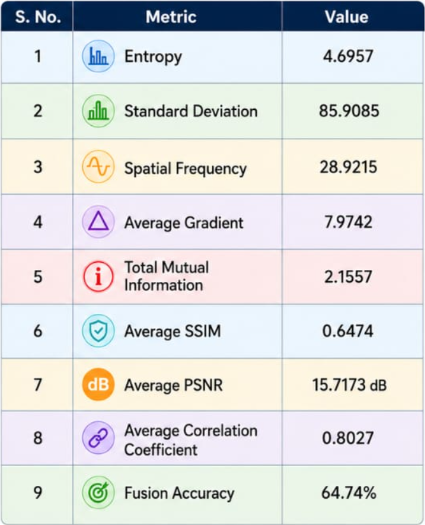

# 🧠 Deep Learning Based Medical Image Fusion

An Attention-based Multi-scale Transformer Fusion Network (AMTF-Net) for fusing MRI and CT medical images using Deep Learning and Explainable AI.

---

## 📌 Project Overview

Medical image fusion combines complementary information from MRI and CT scans into a single informative image for improved diagnosis.

The proposed AMTF-Net integrates

- Multi-scale Feature Extraction
- Attention Mechanism
- Transformer Encoder
- Feature Fusion
- Grad-CAM Explainability

---

## 🚀 Features

✔ MRI-CT Image Fusion

✔ Multi-scale Feature Extraction

✔ Transformer-based Learning

✔ Attention Module

✔ Explainable AI (Grad-CAM)

✔ Performance Evaluation

---

## 🏗 Architecture

---

## 🔄 Workflow

---

## 📂 Dataset

- MRI Images
- CT Images

Dataset is preprocessed using

- Resizing
- Normalization
- Enhancement

---

## 🛠 Technologies Used

| Technology | Purpose |
|------------|----------|
| Python | Programming |
| TensorFlow | Deep Learning |
| PyTorch | Deep Learning |
| OpenCV | Image Processing |
| NumPy | Numerical Computing |
| Matplotlib | Visualization |
| Google Colab | Development |

---

## 📊 Results

### Input Images

---

### Fused Image

---

### Grad-CAM

---

### Evaluation Metrics

| Metric | Value |
|---------|-------|
| Entropy | 4.6957 |
| SSIM | 0.6474 |
| PSNR | 15.7173 dB |
| Mutual Information | 2.1557 |
| Correlation | 0.8027 |
| Fusion Accuracy | 64.74% |

---

## 📈 Future Work

- MRI-PET Fusion
- PET-CT Fusion
- Vision Transformers
- Hybrid Loss Functions
- Clinical Deployment

---

## 👨‍💻 Authors

Sri Hasini Sripada

Lakshmi Hasini Reddy Gondesi

Deekshitha Nava Gopika Mede

Department of Computer Science and Engineering

Aditya University
