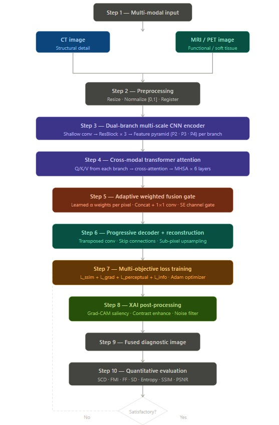
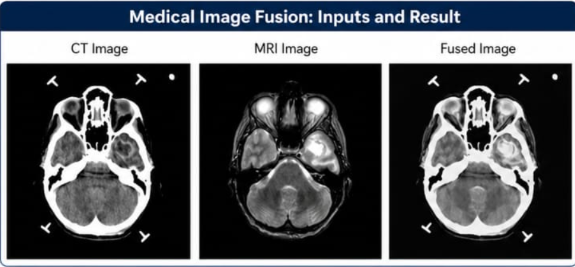
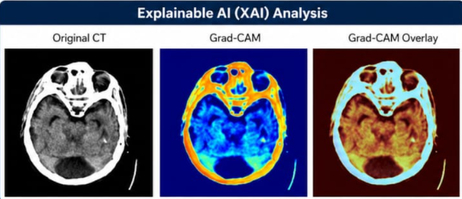

# 🧠 Deep Learning Based Medical Image Fusion

An AI-based Medical Image Fusion project that combines MRI and CT images using Deep Learning techniques to generate high-quality fused medical images for improved diagnosis.

---

## 📌 Project Overview

This project proposes an **Attention-based Multi-scale Transformer Fusion Network (AMTF-Net)** for multimodal medical image fusion.

The framework integrates:

- Multi-scale Feature Extraction
- Attention Mechanism
- Transformer Encoder
- Feature Fusion
- Explainable AI (Grad-CAM)

---

## 🚀 Technologies Used

- Python
- TensorFlow
- PyTorch
- OpenCV
- NumPy
- Matplotlib
- Google Colab

---

# 🔄 Workflow

---

# 🖼️ Fused Image

---

# 🔥 Grad-CAM Overlay

---

# 📊 Evaluation Metrics

---

## ✨ Features

- MRI & CT Image Fusion
- Attention-based Feature Learning
- Multi-scale Feature Extraction
- Transformer-based Architecture
- Explainable AI using Grad-CAM
- Performance Evaluation using SSIM, PSNR, Entropy, MI

---

## 📈 Future Scope

- MRI–PET Image Fusion
- PET–CT Image Fusion
- Vision Transformers (ViT)
- Hybrid Loss Functions
- Clinical Deployment

---

## 👩‍💻 Authors

- Sri Hasini Sripada
- Lakshmi Hasini Reddy Gondesi
- Deekshitha Nava Gopika Mede

Department of Computer Science and Engineering

Aditya University
